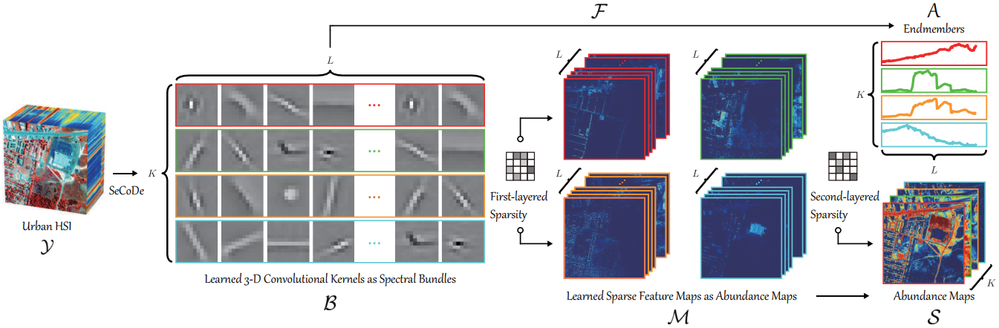

# Sparsity-Enhanced Convolutional Decomposition: A Novel Tensor-Based Paradigm for Blind Hyperspectral Unmixing

[Jing Yao](https://scholar.google.com/citations?user=1SHd5ygAAAAJ&hl=en), [Danfeng Hong](https://sites.google.com/view/danfeng-hong), [Lin Xu](https://scholar.google.com/citations?user=OWRIJLMAAAAJ&hl=en),  [Deyu Meng](https://scholar.google.com/citations?user=an6w-64AAAAJ&hl=en), [Jocelyn Chanussot](http://jocelyn-chanussot.net/), [Zongben Xu](http://gr.xjtu.edu.cn/en/web/zbxu)
---------------------

Run this Matlab code to reproduce the result on Samson Dataset in ["Sparsity-Enhanced Convolutional Decomposition: A Novel Tensor-Based Paradigm for Blind Hyperspectral Unmixing"]().

## Citation Information

**Please kindly cite the papers if this code is useful and helpful for your research.**

## Implementation Details

Before running the main file, please kindly download the Samson dataset from https://rslab.ut.ac.ir/data.

- Our code is built on the SPORCO library, owing to Prof. [Brendt Wohlberg](http://brendt.wohlberg.net/software/SPORCO/).

## Licensing

Copyright (C) 2020 Jing Yao and Danfeng Hong

This program is free software: you can redistribute it and/or modify it under the terms of the GNU General Public License as published by the Free Software Foundation, version 3 of the License.

This program is distributed in the hope that it will be useful, but WITHOUT ANY WARRANTY; without even the implied warranty of MERCHANTABILITY or FITNESS FOR A PARTICULAR PURPOSE. See the GNU General Public License for more details.

You should have received a copy of the GNU General Public License along with this program.

## Contact

If you encounter any bugs while using this code, please do not hesitate to contact us.

Jing Yao (:incoming_envelope: jasonyao92@gmail.com) is with the School of Mathematics and Statistics, Xi'an Jiaotong University, China;

Danfeng Hong (:incoming_envelope: hongdanfeng1989@gmail.com) is with the Remote Sensing Technology Institute (IMF), German Aerospace Center (DLR), Germany, and also with the Singnal Processing in Earth Oberservation (SiPEO), Technical University of Munich (TUM), Germany. 
